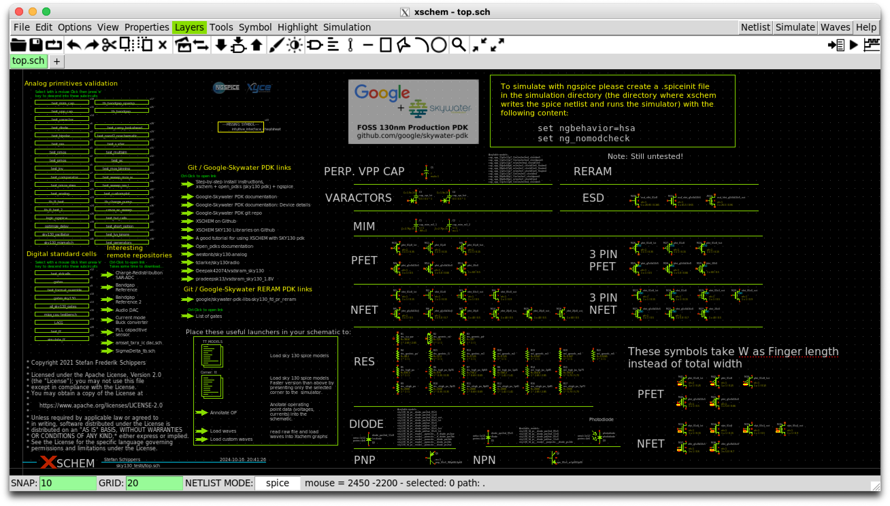

# EE431 Tool Chain
This is a containerized environment for VLSI development in Cal Poly EE431 to install and run the Magic VLSI suite along with the necessary dependencies. 

# Prepare for Installation
## Windows
To start, install [Docker Desktop](https://www.docker.com/products/docker-desktop/). Once set up, enable WSL integration so that your WSL instances can access docker.


## Mac

### Step 1: Install Docker
Install [Docker](https://www.docker.com/products/docker-desktop/). 

After installation open Docker from your mac, make an account and ensure the software is running.

### Step 2: Install and Setup XQuartz
Ensure XQuartz is Installed and Running:

1. Install [XQuartz](https://www.xquartz.org/). Launch XQuartz after installation. Configure XQuartz to Allow Network Connections:
2. Go to XQuartz > Preferences > Security. Uncheck the option Authenticate connections. Check the option Allow connections from network clients.
3. Restart XQuartz for the changes to take effect.

## Linux

Install [Docker](https://www.docker.com/products/docker-desktop/). 

# Installation

### Step 1: Test Docker

Test that docker works by typing `docker`, making sure it does not warn you that you cannot access docker.

### Step 2: Installation

Once you have tested your Docker installation run the following command in your terminal in the location where you want the installation to take place.

```
git clone https://github.com/HenryAEvans/EE431_Toolchain.git
cd EE431_Toolchain
./install.sh
su $USER -c ./install.sh
logout
```

### Step 3: Log In
You might be logged out after the installation takes place. Simply log back in your computer and the installation will be complete. 

# Running Magic

### Step 1: Enter the Container
To run magic, navigate to the directory where it is installed eg. `cd ~/EE431_Toolchain` then run the following command to enter the container

```
./run.sh
```

### Step 2: Launch Magic
Once in the container, simply type `magic` and the program should start up with a gui.

# Verify installation

To verify that you have Magic working properly, run this command in the Docker container.
```
xschem
```
After the command runs, a window should then open that looks like the below image with a bunch of patterns. 


